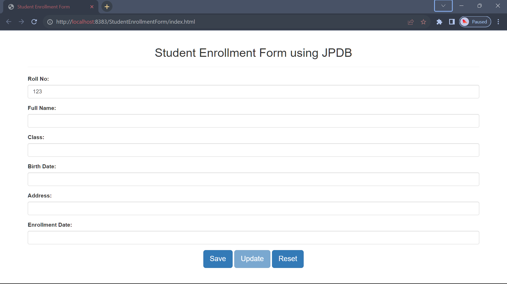
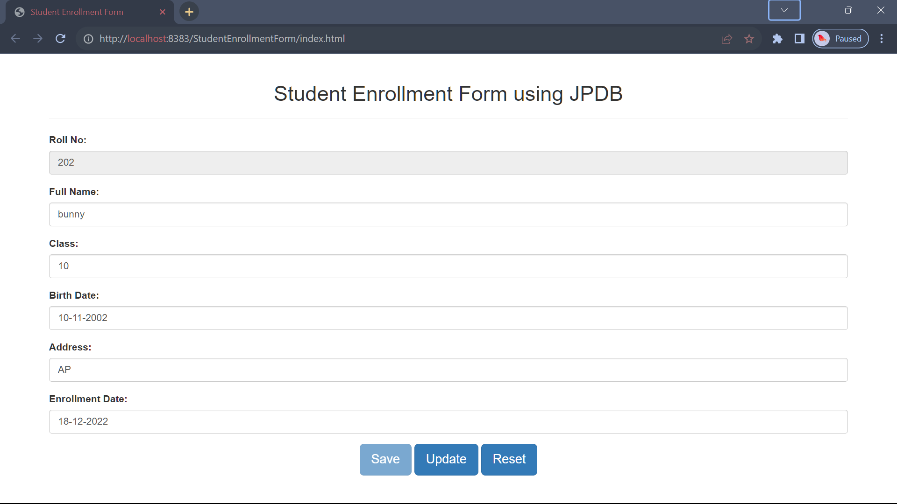

# Student Enrollment Form using JsonPowerDB

## Description

The Student Enrollment Form is a web-based application that allows users to enroll students and store their information in a database. It utilizes JsonPowerDB as the underlying database technology. The form includes fields for Roll No, Full Name, Class, Birth Date, Address, and Enrollment Date. Users can enter and save student details, update existing records, and reset the form when needed.

## Benefits of using JsonPowerDB

JsonPowerDB offers several advantages in this project:
- High performance and low latency, making it ideal for real-time data processing.
- Schema-less and easy to use, allowing for flexible data storage.
- REST API support for seamless integration with web applications.
- Multi-mode database (NoSQL, NewSQL, RDBMS), offering a wide range of data modeling options.

## Release History

- Version 1.0.0 - [14-10-2023]
  - Initial release of the Student Enrollment Form.
  - Basic functionality for saving, updating, and resetting student records.

## Table of Contents

- [Description](#description)
- [Benefits of using JsonPowerDB](#benefits-of-using-jsonpowerdb)
- [Release History](#release-history)
- [Illustrations](#illustrations)
- [Scope of Functionalities](#scope-of-functionalities)
- [Examples of Use](#examples-of-use)
- [Project Status](#project-status)
- [Sources](#sources)

## Illustrations

#### New Form

#### Update

## Scope of Functionalities

The Student Enrollment Form project allows users to:
- Enter and save student information.
- Update existing student records.
- Reset the form to its initial state.
- Perform basic field validation to ensure data integrity.

## Examples of Use

To use the Student Enrollment Form, follow these steps:
1. Enter the Roll No and click outside the field to retrieve an existing student's data or enable the Save button for a new student.
2. Fill in the Full Name, Class, Birth Date, Address, and Enrollment Date.
3. Click the Save button to store the data in the JsonPowerDB database.
4. To update an existing record, click the Update button after retrieving the student's data.
5. To clear the form, click the Reset button.

## Project Status

- Completed

## Sources

- [JsonPowerDB Documentation](https://login2explore.com/jpdb/docs.html)

---

